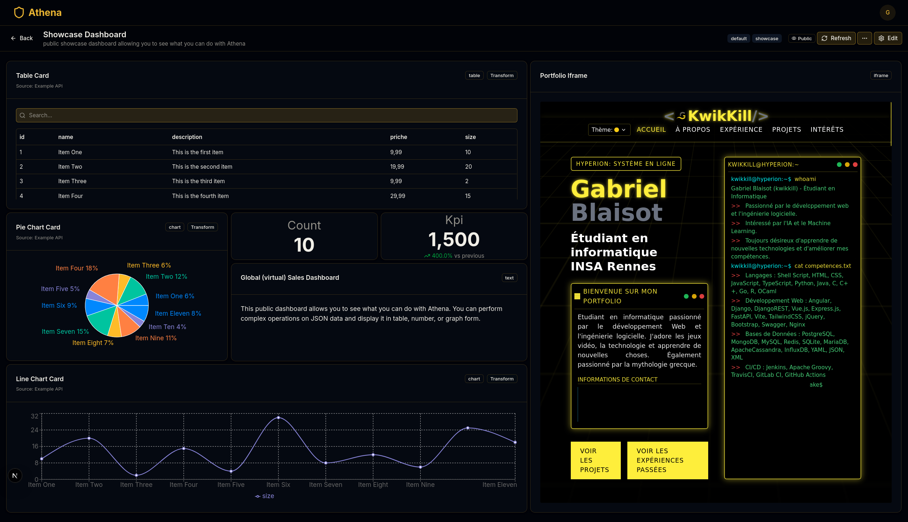

# Athena Dashboard Builder

Athena is a Grafana lite/like web application for visualizing data from REST API datasources.
It allows users to create dashboards with various widgets such as charts, tables, and text boxes.
This application was built using Next.js, React, TypeScript and Tailwind CSS.

## Data Source

Any REST API that returns JSON data can be used as a data source.
You can test with the endpoint `/api/example` which returns sample data.

## Author

This project was created by [KwikKill](https://github.com/KwikKill) as a personal project to improve and practice React and Next.js.
The project is open-source.
